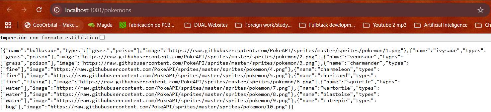
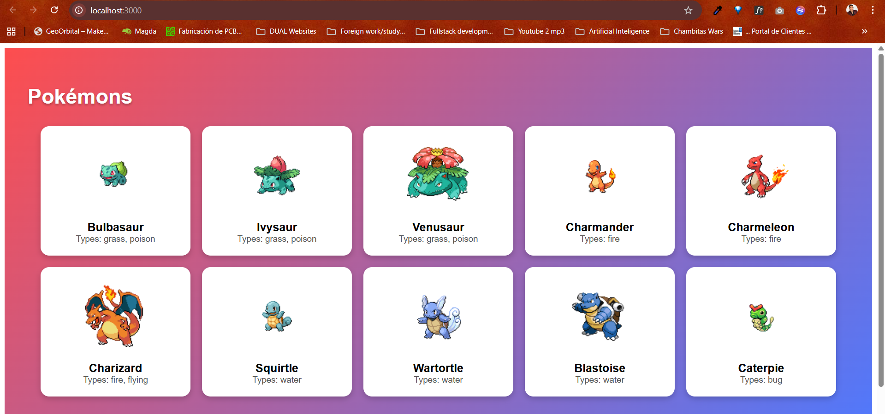
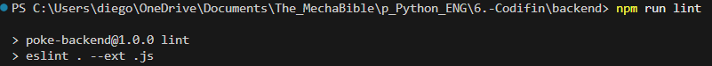
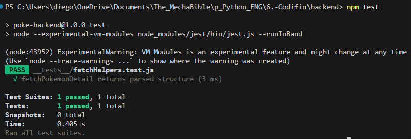

# Codifin: Pokémon - Local Dev

## Requisitos
- Node 18+
- Docker

## Backend (local)
```sh
cd backend
npm install
npm install cors
npm run start
```
open: http://localhost:3001/pokemons


## Frontend (Next.js) (local)
```sh
cd frontend
npm install
npm run dev
```
open: http://localhost:3000


## Docker (dev)
```sh
docker-compose up --build
```
- **Backend** -> http://localhost:3001
- **Frontend** -> http://localhost:3000

## Lint
```sh
cd backend
npm run lint
```


## Tests
```sh
cd backend
npm run test
```
